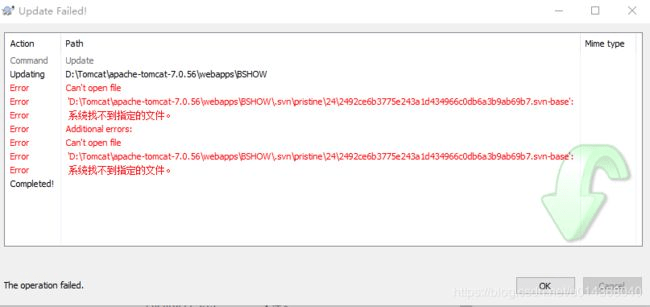
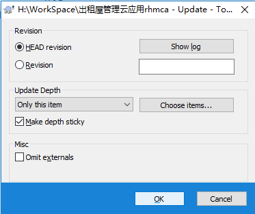
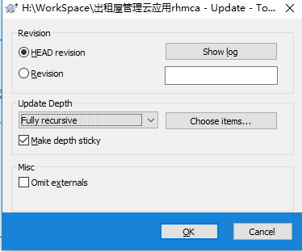

# svn 更新时 can't open file 错误且无法 cleanup 的处理方法

svn 更新报错，错误信息如下：

```text
Error: Can’t open file
Error: ‘D:\Tomcat\apache-tomcat-7.0.56\webapps\BSHOW\.svn\pristine\24\2492ce6b3775e243a1d434966c0db6a3b9ab69b7.svn-base’:
Error: 系统找不到指定的文件。
```



之后提示需要 cleanup，但是在 cleanup 时又会报错。

解决办法：

1. 根据报错文件的路径找到相应的文件位置，手动新建一个 txt 文本并命名为 `2492ce6b3775e243a1d434966c0db6a3b9ab69b7.svn-base`文件；
2. 然后使用 svn 的 update 功能更新文件夹。

<br>
更新后 如果出现 `svn: Checksum mismatch while updating` 错误

解决办法：

在出错文件的目录，右键更新选择用 update to reversion ， 先选 only this item，更新一次，然后再选 Fully recursive 更新一遍。





> 相似问题：[SVN 无法 cleanup 解决方法](https://blog.csdn.net/yunfeiyang62/article/details/44857839)

<!-- [1]: http://image.huawei.com/tiny-lts/v1/images/08fbb274e87ae340a5cd_650x307.png@900-0-90-f.png -->
